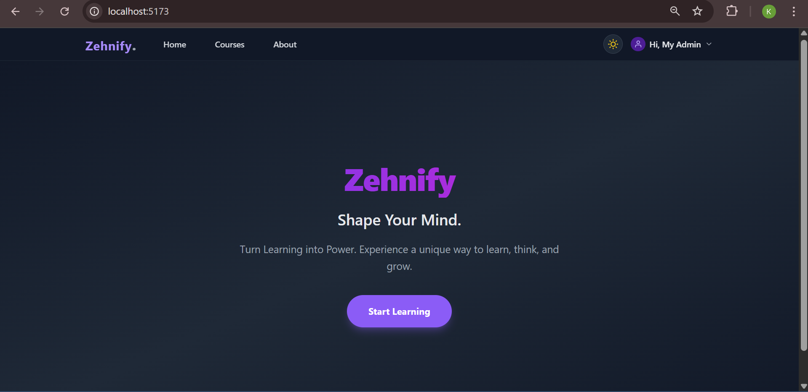

# 🎓 Zehnify - E-Learning Platform

> **Live Demo:** [https://zehnify-learning-platform.vercel.app/](https://zehnify-learning-platform.vercel.app/)  
> **Backend API:** [https://zehnify-backend.onrender.com](https://zehnify-backend.onrender.com)

A complete **Full Stack Learning Management System (LMS)** built with the MERN Stack. This platform allows users to browse courses, enroll, track progress, and watch video lessons. It also features a secure **Admin Panel** for managing course content.

---

## 📸 Screenshots

| **Landing Page** | **Course Player** |
|:---:|:---:|
|  |  |

| **User Dashboard** | **Admin Panel** |
|:---:|:---:|
|  |  |

| **Light Theme View** | **About** |
|:---:|:---:|
|  |  |


---

## 🚀 Features

### 🌟 Public & User Features
- **Authentication:** Secure Login/Signup using JWT & Bcrypt.
- **Course Browsing:** View list of available courses with difficulty levels and prices.
- **User Dashboard:** Track enrolled courses and learning progress.
- **Course Player:** A Netflix-style video player with a syllabus sidebar.
- **Dark Mode:** Fully responsive UI with Light/Dark theme toggle.

### 🛡️ Admin Features
- **Secure Admin Panel:** Protected route (only accessible to users with `role: admin`).
- **Course Management:** Create, Delete, and Update courses directly from the UI.
- **Rich Content:** Support for video URLs, thumbnails, and detailed descriptions.

---

## 🛠️ Tech Stack

- **Frontend:** React.js (Vite), Tailwind CSS, Framer Motion, Axios.
- **Backend:** Node.js, Express.js.
- **Database:** MongoDB Atlas (Cloud).
- **Authentication:** JSON Web Tokens (JWT).
- **Deployment:** Vercel (Frontend) & Render (Backend).

---

## ⚙️ Installation & Run Locally

If you want to run this project locally, follow these steps:

### 1. Clone the Repository
```bash
git clone [https://github.com/zoro-kiki/LearningPlatformPro.git](https://github.com/zoro-kiki/LearningPlatformPro.git)
cd LearningPlatformPro